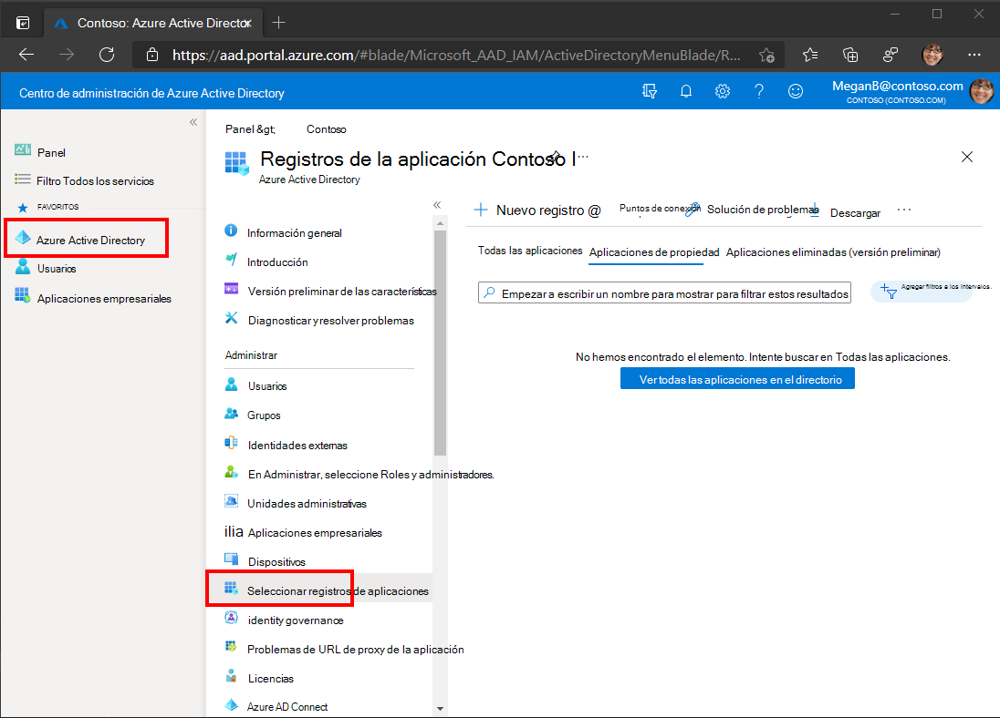
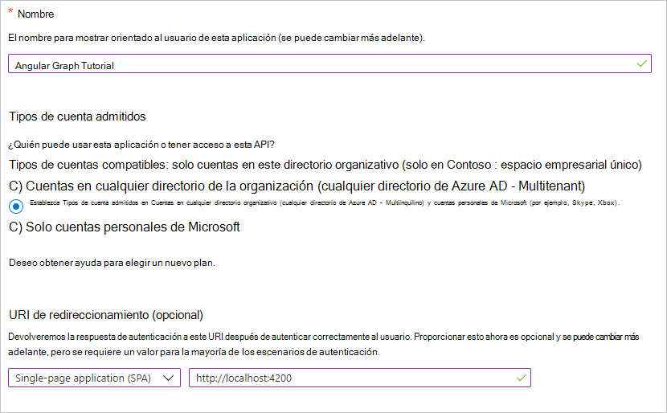

<!-- markdownlint-disable MD002 MD041 -->

En este ejercicio, creará un nuevo registro de aplicaciones web de Azure AD mediante el Centro de administración de Azure Active Directory.

1. Abra un explorador y vaya al [centro de administración de Azure Active Directory](https://aad.portal.azure.com). Inicie sesión con una **cuenta personal** (también conocida como: cuenta Microsoft) o una **cuenta profesional o educativa**.

1. Seleccione **Azure Active Directory** en el panel de navegación izquierdo y, a continuación, seleccione **Registros de aplicaciones** en **Administrar**.

    

1. Seleccione **Nuevo registro**. En la página **Registrar una aplicación**, establezca los valores siguientes.

    - Establezca **Nombre** como `Angular Graph Tutorial`.
    - Establezca **Tipos de cuenta admitidos** en **Cuentas en cualquier directorio de organización y cuentas personales de Microsoft**.
    - En **URI de redirección**, establezca la primera lista desplegable en `Single-page application (SPA)` y establezca el valor `http://localhost:4200`.

    

1. Seleccione **Registrar**. En la **página Tutorial de Angular Graph,** copie el valor del identificador de aplicación **(cliente)** y guárdelo, lo necesitará en el paso siguiente.

    
