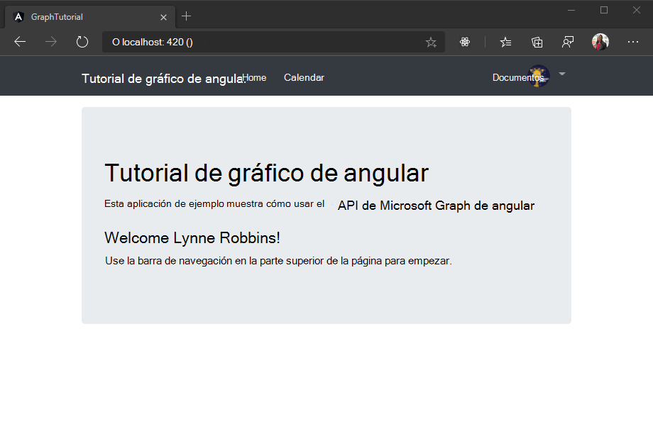
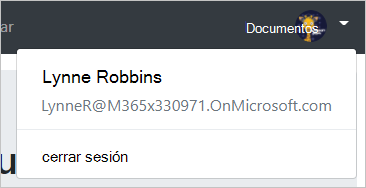

<!-- markdownlint-disable MD002 MD041 -->

En este ejercicio, ampliará la aplicación del ejercicio anterior para admitir la autenticación con Azure AD. Esto es necesario para obtener el token de acceso de OAuth necesario para llamar a Microsoft Graph. En este paso, integrará la [biblioteca de autenticación de Microsoft para angular](https://github.com/AzureAD/microsoft-authentication-library-for-js/blob/dev/lib/msal-angular/README.md) en la aplicación.

1. Cree un nuevo archivo en el `./src` directorio denominado `oauth.ts` y agregue el siguiente código.

    :::code language="typescript" source="../demo/graph-tutorial/src/oauth.ts.example":::

    Reemplace `YOUR_APP_ID_HERE` por el identificador de la aplicación del portal de registro de aplicaciones.

    > [!IMPORTANT]
    > Si usa un control de código fuente como GIT, ahora sería un buen momento para excluir el `oauth.ts` archivo del control de código fuente para evitar la pérdida inadvertida del identificador de la aplicación.

1. Abra `./src/app/app.module.ts` y agregue las siguientes `import` instrucciones en la parte superior del archivo.

    ```TypeScript
    import { MsalModule } from '@azure/msal-angular';
    import { OAuthSettings } from '../oauth';
    ```

1. Agregue el `MsalModule` a la `imports` matriz dentro de `@NgModule` la declaración e inicialícela con el identificador de la aplicación.

    :::code language="typescript" source="../demo/graph-tutorial/src/app/app.module.ts" id="imports":::

## <a name="implement-sign-in"></a>Implementar el inicio de sesión

En esta sección, creará un servicio de autenticación e implementará el inicio y el cierre de sesión.

1. Ejecute el siguiente comando en su CLI.

    ```Shell
    ng generate service auth
    ```

    Al crear un servicio para esto, puede inyectarlo fácilmente en cualquier componente que necesite acceso a los métodos de autenticación.

1. Una vez que finalice el comando, `./src/app/auth.service.ts` Abra el archivo y reemplace el contenido por el código siguiente.

    ```TypeScript
    import { Injectable } from '@angular/core';
    import { MsalService } from '@azure/msal-angular';

    import { AlertsService } from './alerts.service';
    import { OAuthSettings } from '../oauth';
    import { User } from './user';

    @Injectable({
      providedIn: 'root'
    })

    export class AuthService {
      public authenticated: boolean;
      public user: User;

      constructor(
        private msalService: MsalService,
        private alertsService: AlertsService) {

        this.authenticated = false;
        this.user = null;
      }

      // Prompt the user to sign in and
      // grant consent to the requested permission scopes
      async signIn(): Promise<void> {
        let result = await this.msalService.loginPopup(OAuthSettings)
          .catch((reason) => {
            this.alertsService.add('Login failed', JSON.stringify(reason, null, 2));
          });

        if (result) {
          this.authenticated = true;
          // Temporary placeholder
          this.user = new User();
          this.user.displayName = "Adele Vance";
          this.user.email = "AdeleV@contoso.com";
        }
      }

      // Sign out
      signOut(): void {
        this.msalService.logout();
        this.user = null;
        this.authenticated = false;
      }

      // Silently request an access token
      async getAccessToken(): Promise<string> {
        let result = await this.msalService.acquireTokenSilent(OAuthSettings)
          .catch((reason) => {
            this.alertsService.add('Get token failed', JSON.stringify(reason, null, 2));
          });

        if (result) {
          // Temporary to display token in an error box
          this.alertsService.add('Token acquired', result.accessToken);
          return result.accessToken;
        }
        return null;
      }
    }
    ```

1. Abra el `./src/app/nav-bar/nav-bar.component.ts` archivo y reemplace el contenido por lo siguiente.

    :::code language="typescript" source="../demo/graph-tutorial/src/app/nav-bar/nav-bar.component.ts" id="navBarSnippet" highlight="3,15-22,24,26-28,36-38,40-42":::

1. Abra`./src/app/home/home.component.ts` y reemplace su contenido por lo siguiente.

    :::code language="typescript" source="snippets/snippets.ts" id="homeSnippet" highlight="3,12-19,21,23,25-27":::

Guarde los cambios y actualice el explorador. Haga clic en el botón **haga clic aquí para iniciar sesión** y debe redirigirse a `https://login.microsoftonline.com`. Inicie sesión con su cuenta de Microsoft y dé su consentimiento a los permisos solicitados. La página de la aplicación debe actualizarse y mostrar el token.

### <a name="get-user-details"></a>Obtener detalles del usuario

Ahora, el servicio de autenticación establece valores constantes para el nombre para mostrar y la dirección de correo electrónico del usuario. Ahora que tiene un token de acceso, puede obtener detalles del usuario de Microsoft Graph para que esos valores se correspondan con el usuario actual.

1. Abra `./src/app/auth.service.ts` y agregue la siguiente `import` instrucción a la parte superior del archivo.

    ```TypeScript
    import { Client } from '@microsoft/microsoft-graph-client';
    ```

1. Agregue una nueva función llamada `AuthService` a la clase `getUser`.

    :::code language="typescript" source="../demo/graph-tutorial/src/app/auth.service.ts" id="getUserSnippet":::

1. Busque y quite el código siguiente en el `getAccessToken` método que agrega una alerta para mostrar el token de acceso.

    ```TypeScript
    // Temporary to display token in an error box
    this.alertsService.add('Token acquired', result);
    ```

1. Busque y quite el código siguiente del `signIn` método.

    ```TypeScript
    // Temporary placeholder
    this.user = new User();
    this.user.displayName = "Adele Vance";
    this.user.email = "AdeleV@contoso.com";
    ```

1. En su ubicación, agregue el siguiente código.

    ```TypeScript
    this.user = await this.getUser();
    ```

    Este nuevo código usa el SDK de Microsoft Graph para obtener los detalles del usuario y, a `User` continuación, crea un objeto con los valores devueltos por la llamada a la API.

1. Cambie la `constructor` para la `AuthService` clase para comprobar si el usuario ya ha iniciado sesión y cargar sus detalles en caso afirmativo. Reemplace el existente `constructor` por lo siguiente.

    :::code language="typescript" source="../demo/graph-tutorial/src/app/auth.service.ts" id="constructorSnippet" highlight="5-6":::

1. Quite el código temporal de la `HomeComponent` clase. Abra el `./src/app/home/home.component.ts` archivo y reemplace la función `signIn` existente por lo siguiente.

    :::code language="typescript" source="../demo/graph-tutorial/src/app/home/home.component.ts" id="signInSnippet" highlight="5-6":::

Ahora, si guarda los cambios e inicia la aplicación, después de iniciar sesión debe terminar de nuevo en la Página principal, pero la interfaz de usuario debe cambiar para indicar que ha iniciado sesión.



Haga clic en el avatar de usuario en la esquina superior derecha para acceder al vínculo **Cerrar sesión** . Al hacer clic en **cerrar** sesión se restablece la sesión y se vuelve a la Página principal.



## <a name="storing-and-refreshing-tokens"></a>Almacenamiento y actualización de tokens

En este punto, la aplicación tiene un token de acceso, que se envía `Authorization` en el encabezado de las llamadas a la API. Este es el token que permite que la aplicación tenga acceso a Microsoft Graph en nombre del usuario.

Sin embargo, este token es de corta duración. El token expira una hora después de su emisión. Debido a que la aplicación usa la biblioteca de MSAL, no tiene que implementar ninguna lógica de almacenamiento o actualización de tokens. El `MsalService` almacena en caché el token en el almacenamiento del explorador. El `acquireTokenSilent` método comprueba primero el token almacenado en caché y, si no lo ha expirado, lo devuelve. Si ha expirado, realiza una solicitud silenciosa para obtener uno nuevo.
