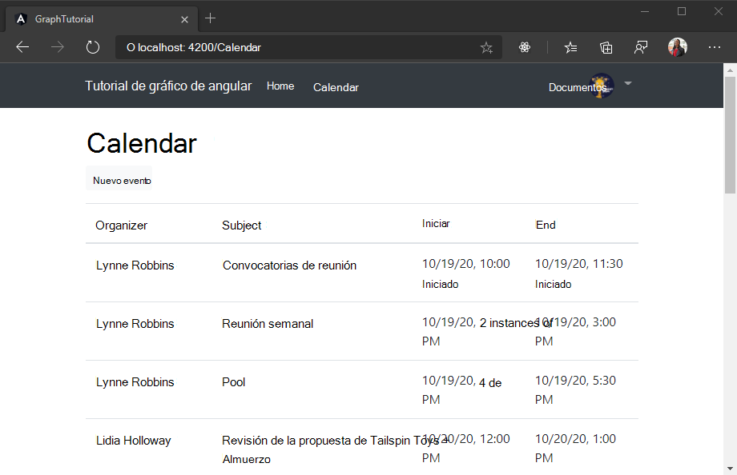

<!-- markdownlint-disable MD002 MD041 -->

<span data-ttu-id="6f9c1-101">En este ejercicio, incorporará Microsoft Graph a la aplicación.</span><span class="sxs-lookup"><span data-stu-id="6f9c1-101">In this exercise you will incorporate the Microsoft Graph into the application.</span></span> <span data-ttu-id="6f9c1-102">Para esta aplicación, usará la biblioteca de [Microsoft-Graph-Client](https://github.com/microsoftgraph/msgraph-sdk-javascript) para realizar llamadas a Microsoft Graph.</span><span class="sxs-lookup"><span data-stu-id="6f9c1-102">For this application, you will use the [microsoft-graph-client](https://github.com/microsoftgraph/msgraph-sdk-javascript) library to make calls to Microsoft Graph.</span></span>

## <a name="get-calendar-events-from-outlook"></a><span data-ttu-id="6f9c1-103">Obtener eventos de calendario de Outlook</span><span class="sxs-lookup"><span data-stu-id="6f9c1-103">Get calendar events from Outlook</span></span>

<span data-ttu-id="6f9c1-104">Empiece por crear una `Event` clase que defina los campos que mostrará la aplicación.</span><span class="sxs-lookup"><span data-stu-id="6f9c1-104">Start by creating an `Event` class that defines the fields that the app will display.</span></span> <span data-ttu-id="6f9c1-105">Cree un nuevo archivo en el `./src/app` directorio denominado `event.ts` y agregue el siguiente código.</span><span class="sxs-lookup"><span data-stu-id="6f9c1-105">Create a new file in the `./src/app` directory called `event.ts` and add the following code.</span></span>

```TypeScript
// For a full list of fields, see
// https://docs.microsoft.com/graph/api/resources/event?view=graph-rest-1.0
export class Event {
  subject: string;
  organizer: Recipient;
  start: DateTimeTimeZone;
  end: DateTimeTimeZone;
}

// https://docs.microsoft.com/graph/api/resources/recipient?view=graph-rest-1.0
export class Recipient {
  emailAddress: EmailAddress;
}

// https://docs.microsoft.com/graph/api/resources/emailaddress?view=graph-rest-1.0
export class EmailAddress {
  name: string;
  address: string;
}

// https://docs.microsoft.com/graph/api/resources/datetimetimezone?view=graph-rest-1.0
export class DateTimeTimeZone {
  dateTime: string;
  timeZone: string;
}
```

<span data-ttu-id="6f9c1-106">A continuación, agregue un nuevo servicio que contenga todas las llamadas de gráfico.</span><span class="sxs-lookup"><span data-stu-id="6f9c1-106">Next, add a new service to hold all of your Graph calls.</span></span> <span data-ttu-id="6f9c1-107">Al igual que con el servicio de autenticación que creó anteriormente, la creación de un servicio le permite inyectarlo en cualquier componente que necesite acceso a Microsoft Graph.</span><span class="sxs-lookup"><span data-stu-id="6f9c1-107">Just as with the authentication service you created earlier, creating a service for this allows you to inject it into any components that need access to Microsoft Graph.</span></span> <span data-ttu-id="6f9c1-108">Ejecute el siguiente comando en su CLI.</span><span class="sxs-lookup"><span data-stu-id="6f9c1-108">Run the following command in your CLI.</span></span>

```Shell
ng generate service graph
```

<span data-ttu-id="6f9c1-109">Una vez que haya finalizado el comando `./src/app/graph.service.ts` , abra el archivo y reemplace el contenido por lo siguiente.</span><span class="sxs-lookup"><span data-stu-id="6f9c1-109">Once the command completes, open the `./src/app/graph.service.ts` file and replace its contents with the following.</span></span>

```TypeScript
import { Injectable } from '@angular/core';
import { Client } from '@microsoft/microsoft-graph-client';

import { AuthService } from './auth.service';
import { Event } from './event';
import { AlertsService } from './alerts.service';

@Injectable({
  providedIn: 'root'
})
export class GraphService {

  private graphClient: Client;
  constructor(
    private authService: AuthService,
    private alertsService: AlertsService) {

    // Initialize the Graph client
    this.graphClient = Client.init({
      authProvider: async (done) => {
        // Get the token from the auth service
        let token = await this.authService.getAccessToken()
          .catch((reason) => {
            done(reason, null);
          });

        if (token)
        {
          done(null, token);
        } else {
          done("Could not get an access token", null);
        }
      }
    });
  }

  async getEvents(): Promise<Event[]> {
    try {
      let result =  await this.graphClient
        .api('/me/events')
        .select('subject,organizer,start,end')
        .orderby('createdDateTime DESC')
        .get();

      return result.value;
    } catch (error) {
      this.alertsService.add('Could not get events', JSON.stringify(error, null, 2));
    }
  }
}
```

<span data-ttu-id="6f9c1-110">Tenga en cuenta lo que está haciendo este código.</span><span class="sxs-lookup"><span data-stu-id="6f9c1-110">Consider what this code is doing.</span></span>

- <span data-ttu-id="6f9c1-111">Inicializa un cliente de Graph en el constructor del servicio.</span><span class="sxs-lookup"><span data-stu-id="6f9c1-111">It initializes a Graph client in the constructor for the service.</span></span>
- <span data-ttu-id="6f9c1-112">Implementa una `getEvents` función que usa el cliente de Graph de la siguiente manera:</span><span class="sxs-lookup"><span data-stu-id="6f9c1-112">It implements a `getEvents` function that uses the Graph client in the following way:</span></span>
  - <span data-ttu-id="6f9c1-113">La dirección URL a la que se `/me/events`llamará es.</span><span class="sxs-lookup"><span data-stu-id="6f9c1-113">The URL that will be called is `/me/events`.</span></span>
  - <span data-ttu-id="6f9c1-114">El `select` método limita los campos devueltos para cada evento a solo aquellos que la vista usará realmente.</span><span class="sxs-lookup"><span data-stu-id="6f9c1-114">The `select` method limits the fields returned for each events to just those the view will actually use.</span></span>
  - <span data-ttu-id="6f9c1-115">El `orderby` método ordena los resultados por la fecha y hora en que se crearon, con el elemento más reciente en primer lugar.</span><span class="sxs-lookup"><span data-stu-id="6f9c1-115">The `orderby` method sorts the results by the date and time they were created, with the most recent item being first.</span></span>

<span data-ttu-id="6f9c1-116">Ahora cree un componente angular para llamar a este nuevo método y mostrar los resultados de la llamada.</span><span class="sxs-lookup"><span data-stu-id="6f9c1-116">Now create an Angular component to call this new method and display the results of the call.</span></span> <span data-ttu-id="6f9c1-117">Ejecute el siguiente comando en su CLI.</span><span class="sxs-lookup"><span data-stu-id="6f9c1-117">Run the following command in your CLI.</span></span>

```Shell
ng generate component calendar
```

<span data-ttu-id="6f9c1-118">Una vez que finalice el comando, agregue el componente a `routes` la matriz `./src/app/app-routing.module.ts`de.</span><span class="sxs-lookup"><span data-stu-id="6f9c1-118">Once the command completes, add the component to the `routes` array in `./src/app/app-routing.module.ts`.</span></span>

```TypeScript
import { CalendarComponent } from './calendar/calendar.component';

const routes: Routes = [
  { path: '', component: HomeComponent },
  { path: 'calendar', component: CalendarComponent }
];
```

<span data-ttu-id="6f9c1-119">Abra el `./src/app/calendar/calendar.component.ts` archivo y reemplace el contenido por lo siguiente.</span><span class="sxs-lookup"><span data-stu-id="6f9c1-119">Open the `./src/app/calendar/calendar.component.ts` file and replace its contents with the following.</span></span>

```TypeScript
import { Component, OnInit } from '@angular/core';
import * as moment from 'moment-timezone';

import { GraphService } from '../graph.service';
import { Event, DateTimeTimeZone } from '../event';
import { AlertsService } from '../alerts.service';

@Component({
  selector: 'app-calendar',
  templateUrl: './calendar.component.html',
  styleUrls: ['./calendar.component.css']
})
export class CalendarComponent implements OnInit {

  private events: Event[];

  constructor(
    private graphService: GraphService,
    private alertsService: AlertsService) { }

  ngOnInit() {
    this.graphService.getEvents()
      .then((events) => {
        this.events = events;
        // Temporary to display raw results
        this.alertsService.add('Events from Graph', JSON.stringify(events, null, 2));
      });
  }
}
```

<span data-ttu-id="6f9c1-120">Por ahora, esto solo representa la matriz de eventos en JSON en la página.</span><span class="sxs-lookup"><span data-stu-id="6f9c1-120">For now this just renders the array of events in JSON on the page.</span></span> <span data-ttu-id="6f9c1-121">Guarde los cambios y reinicie la aplicación.</span><span class="sxs-lookup"><span data-stu-id="6f9c1-121">Save your changes and restart the app.</span></span> <span data-ttu-id="6f9c1-122">Inicie sesión y haga clic en el vínculo de **calendario** en la barra de navegación.</span><span class="sxs-lookup"><span data-stu-id="6f9c1-122">Sign in and click the **Calendar** link in the nav bar.</span></span> <span data-ttu-id="6f9c1-123">Si todo funciona, debería ver un volcado JSON de eventos en el calendario del usuario.</span><span class="sxs-lookup"><span data-stu-id="6f9c1-123">If everything works, you should see a JSON dump of events on the user's calendar.</span></span>

## <a name="display-the-results"></a><span data-ttu-id="6f9c1-124">Mostrar los resultados</span><span class="sxs-lookup"><span data-stu-id="6f9c1-124">Display the results</span></span>

<span data-ttu-id="6f9c1-125">Ahora puede actualizar el `CalendarComponent` componente para mostrar los eventos de forma más fácil de uso.</span><span class="sxs-lookup"><span data-stu-id="6f9c1-125">Now you can update the `CalendarComponent` component to display the events in a more user-friendly manner.</span></span> <span data-ttu-id="6f9c1-126">En primer lugar, quite el código temporal que agrega una alerta `ngOnInit` de la función.</span><span class="sxs-lookup"><span data-stu-id="6f9c1-126">First, remove the temporary code that adds an alert from the `ngOnInit` function.</span></span> <span data-ttu-id="6f9c1-127">La función actualizada debería tener este aspecto.</span><span class="sxs-lookup"><span data-stu-id="6f9c1-127">Your updated function should look like this.</span></span>

```TypeScript
ngOnInit() {
  this.graphService.getEvents()
    .then((events) => {
      this.events = events;
    });
}
```

<span data-ttu-id="6f9c1-128">Ahora, agregue una función a `CalendarComponent` la clase para dar `DateTimeTimeZone` formato a un objeto en una cadena ISO.</span><span class="sxs-lookup"><span data-stu-id="6f9c1-128">Now add a function to the `CalendarComponent` class to format a `DateTimeTimeZone` object into an ISO string.</span></span>

```TypeScript
formatDateTimeTimeZone(dateTime: DateTimeTimeZone): string {
  try {
    return moment.tz(dateTime.dateTime, dateTime.timeZone).format();
  }
  catch(error) {
    this.alertsService.add('DateTimeTimeZone conversion error', JSON.stringify(error));
  }
}
```

<span data-ttu-id="6f9c1-129">Por último, Abra `./src/app/calendar/calendar.component.html` el archivo y reemplace el contenido por lo siguiente.</span><span class="sxs-lookup"><span data-stu-id="6f9c1-129">Finally, open the `./src/app/calendar/calendar.component.html` file and replace its contents with the following.</span></span>

```html
<h1>Calendar</h1>
<table class="table">
  <thead>
    <th scope="col">Organizer</th>
    <th scope="col">Subject</th>
    <th scope="col">Start</th>
    <th scope="col">End</th>
  </thead>
  <tbody>
    <tr *ngFor="let event of events">
      <td>{{event.organizer.emailAddress.name}}</td>
      <td>{{event.subject}}</td>
      <td>{{formatDateTimeTimeZone(event.start) | date:'short' }}</td>
      <td>{{formatDateTimeTimeZone(event.end) | date: 'short' }}</td>
    </tr>
  </tbody>
</table>
```

<span data-ttu-id="6f9c1-130">Esto recorre la colección de eventos y agrega una fila de tabla para cada uno.</span><span class="sxs-lookup"><span data-stu-id="6f9c1-130">This loops through the collection of events and adds a table row for each one.</span></span> <span data-ttu-id="6f9c1-131">Guarde los cambios y reinicie la aplicación.</span><span class="sxs-lookup"><span data-stu-id="6f9c1-131">Save the changes and restart the app.</span></span> <span data-ttu-id="6f9c1-132">Haga clic en el vínculo del **calendario** y la aplicación ahora debe representar una tabla de eventos.</span><span class="sxs-lookup"><span data-stu-id="6f9c1-132">Click on the **Calendar** link and the app should now render a table of events.</span></span>

