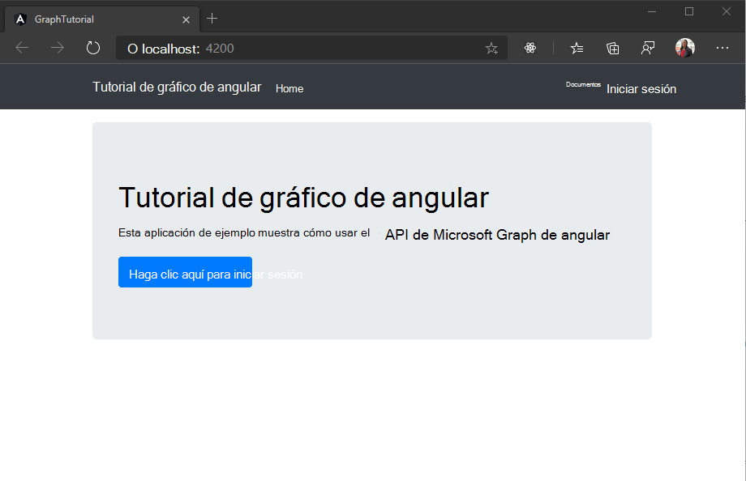

<!-- markdownlint-disable MD002 MD041 -->

<span data-ttu-id="8e3a1-101">Abra la interfaz de línea de comandos (CLI), vaya a un directorio donde tenga derechos para crear archivos y ejecute los siguientes comandos para instalar la herramienta angular de la [CLI](https://www.npmjs.com/package/@angular/cli) y crear una nueva aplicación de angular.</span><span class="sxs-lookup"><span data-stu-id="8e3a1-101">Open your command-line interface (CLI), navigate to a directory where you have rights to create files, and run the following commands to install the [Angular CLI](https://www.npmjs.com/package/@angular/cli) tool and create a new Angular app.</span></span>

```Shell
npm install -g @angular/cli
ng new graph-tutorial
```

<span data-ttu-id="8e3a1-102">El CLI de angular le pedirá más información.</span><span class="sxs-lookup"><span data-stu-id="8e3a1-102">The Angular CLI will prompt for more information.</span></span> <span data-ttu-id="8e3a1-103">Responda a los mensajes como se indica a continuación.</span><span class="sxs-lookup"><span data-stu-id="8e3a1-103">Answer the prompts as follows.</span></span>

```Shell
? Would you like to add Angular routing? Yes
? Which stylesheet format would you like to use? CSS
```

<span data-ttu-id="8e3a1-104">Una vez que finalice el comando, cambie `graph-tutorial` al directorio de la CLI y ejecute el siguiente comando para iniciar un servidor Web local.</span><span class="sxs-lookup"><span data-stu-id="8e3a1-104">Once the command finishes, change to the `graph-tutorial` directory in your CLI and run the following command to start a local web server.</span></span>

```Shell
ng serve --open
```

<span data-ttu-id="8e3a1-105">El explorador predeterminado se abre [https://localhost:4200/](https://localhost:4200) en con una página angular predeterminada.</span><span class="sxs-lookup"><span data-stu-id="8e3a1-105">Your default browser opens to [https://localhost:4200/](https://localhost:4200) with a default Angular page.</span></span> <span data-ttu-id="8e3a1-106">Si el explorador no se abre, ábralo y vaya [https://localhost:4200/](https://localhost:4200) a para comprobar que la nueva aplicación funciona.</span><span class="sxs-lookup"><span data-stu-id="8e3a1-106">If your browser doesn't open, open it and browse to [https://localhost:4200/](https://localhost:4200) to verify that the new app works.</span></span>

<span data-ttu-id="8e3a1-107">Antes de continuar, instale algunos paquetes adicionales que usará más adelante:</span><span class="sxs-lookup"><span data-stu-id="8e3a1-107">Before moving on, install some additional packages that you will use later:</span></span>

- <span data-ttu-id="8e3a1-108">[bootstrap](https://github.com/twbs/bootstrap) para aplicar estilos y componentes comunes.</span><span class="sxs-lookup"><span data-stu-id="8e3a1-108">[bootstrap](https://github.com/twbs/bootstrap) for styling and common components.</span></span>
- <span data-ttu-id="8e3a1-109">[ng-bootstrap](https://github.com/ng-bootstrap/ng-bootstrap) para usar componentes bootstrap desde angular.</span><span class="sxs-lookup"><span data-stu-id="8e3a1-109">[ng-bootstrap](https://github.com/ng-bootstrap/ng-bootstrap) for using Bootstrap components from Angular.</span></span>
- <span data-ttu-id="8e3a1-110">[angular-fontawesome](https://github.com/FortAwesome/angular-fontawesome) para usar iconos de Fontawesome en angular.</span><span class="sxs-lookup"><span data-stu-id="8e3a1-110">[angular-fontawesome](https://github.com/FortAwesome/angular-fontawesome) to use FontAwesome icons in Angular.</span></span>
- <span data-ttu-id="8e3a1-111">[fontawesome-SVG-Core](https://github.com/FortAwesome/Font-Awesome), [Free-regular-SVG-Icons](https://github.com/FortAwesome/Font-Awesome)y [Free-Solid-SVG-Icons](https://github.com/FortAwesome/Font-Awesome) para los iconos fontawesome usados en el ejemplo.</span><span class="sxs-lookup"><span data-stu-id="8e3a1-111">[fontawesome-svg-core](https://github.com/FortAwesome/Font-Awesome), [free-regular-svg-icons](https://github.com/FortAwesome/Font-Awesome), and [free-solid-svg-icons](https://github.com/FortAwesome/Font-Awesome) for the FontAwesome icons used in the sample.</span></span>
- <span data-ttu-id="8e3a1-112">[momento](https://github.com/moment/moment) para dar formato a fechas y horas.</span><span class="sxs-lookup"><span data-stu-id="8e3a1-112">[moment](https://github.com/moment/moment) for formatting dates and times.</span></span>
- <span data-ttu-id="8e3a1-113">[msal-angular](https://github.com/AzureAD/microsoft-authentication-library-for-js/blob/dev/lib/msal-angular/README.md) para autenticar en Azure Active Directory y recuperar tokens de acceso.</span><span class="sxs-lookup"><span data-stu-id="8e3a1-113">[msal-angular](https://github.com/AzureAD/microsoft-authentication-library-for-js/blob/dev/lib/msal-angular/README.md) for authenticating to Azure Active Directory and retrieving access tokens.</span></span>
- <span data-ttu-id="8e3a1-114">[rxjs-compat](https://github.com/ReactiveX/rxjs/tree/master/compat), necesario para `msal-angular` el paquete.</span><span class="sxs-lookup"><span data-stu-id="8e3a1-114">[rxjs-compat](https://github.com/ReactiveX/rxjs/tree/master/compat), required for the `msal-angular` package.</span></span>
- <span data-ttu-id="8e3a1-115">[Microsoft-Graph-Client](https://github.com/microsoftgraph/msgraph-sdk-javascript) para realizar llamadas a Microsoft Graph.</span><span class="sxs-lookup"><span data-stu-id="8e3a1-115">[microsoft-graph-client](https://github.com/microsoftgraph/msgraph-sdk-javascript) for making calls to Microsoft Graph.</span></span>

<span data-ttu-id="8e3a1-116">Ejecute el siguiente comando en su CLI.</span><span class="sxs-lookup"><span data-stu-id="8e3a1-116">Run the following command in your CLI.</span></span>

```Shell
npm install bootstrap@4.3.1 @fortawesome/angular-fontawesome@0.3.0 @fortawesome/fontawesome-svg-core@1.2.15
npm install @fortawesome/free-regular-svg-icons@5.7.2 @fortawesome/free-solid-svg-icons@5.7.2
npm install moment@2.24.0 moment-timezone@0.5.23 @ng-bootstrap/ng-bootstrap@4.1.0
npm install @azure/msal-angular@0.1.2 rxjs-compat@6.4.0 @microsoft/microsoft-graph-client@1.4.0
```

## <a name="design-the-app"></a><span data-ttu-id="8e3a1-117">Diseñar la aplicación</span><span class="sxs-lookup"><span data-stu-id="8e3a1-117">Design the app</span></span>

<span data-ttu-id="8e3a1-118">Empiece agregando los archivos CSS de bootstrap a la aplicación, así como algunos estilos globales.</span><span class="sxs-lookup"><span data-stu-id="8e3a1-118">Start by adding the Bootstrap CSS files to the app, as well as some global styles.</span></span> <span data-ttu-id="8e3a1-119">Abra el `./src/styles.css` y agregue las siguientes líneas.</span><span class="sxs-lookup"><span data-stu-id="8e3a1-119">Open the `./src/styles.css` and add the following lines.</span></span>

```CSS
@import "~bootstrap/dist/css/bootstrap.css";

/* Add padding for the nav bar */
body {
  padding-top: 4.5rem;
}

/* Style debug info in alerts */
.alert-pre {
  word-wrap: break-word;
  word-break: break-all;
  white-space: pre-wrap;
}
```

<span data-ttu-id="8e3a1-120">A continuación, agregue los módulos bootstrap y FontAwesome a la aplicación.</span><span class="sxs-lookup"><span data-stu-id="8e3a1-120">Next, add the Bootstrap and FontAwesome modules to the app.</span></span> <span data-ttu-id="8e3a1-121">Abra `./src/app/app.module.ts` y agregue las siguientes `import` instrucciones en la parte superior del archivo.</span><span class="sxs-lookup"><span data-stu-id="8e3a1-121">Open `./src/app/app.module.ts` and add the following `import` statements to the top of the file.</span></span>

```TypeScript
import { NgbModule } from '@ng-bootstrap/ng-bootstrap';
import { FontAwesomeModule } from '@fortawesome/angular-fontawesome';
import { library } from '@fortawesome/fontawesome-svg-core';
import { faExternalLinkAlt } from '@fortawesome/free-solid-svg-icons';
import { faUserCircle } from '@fortawesome/free-regular-svg-icons';
```

<span data-ttu-id="8e3a1-122">A continuación, agregue el siguiente código después de `import` todas las instrucciones.</span><span class="sxs-lookup"><span data-stu-id="8e3a1-122">Then add the following code after all of the `import` statements.</span></span>

```TypeScript
library.add(faExternalLinkAlt);
library.add(faUserCircle);
```

<span data-ttu-id="8e3a1-123">En la `@NgModule` declaración, reemplace la matriz `imports` existente por lo siguiente.</span><span class="sxs-lookup"><span data-stu-id="8e3a1-123">In the `@NgModule` declaration, replace the existing `imports` array with the following.</span></span>

```TypeScript
imports: [
  BrowserModule,
  AppRoutingModule,
  NgbModule,
  FontAwesomeModule
]
```

<span data-ttu-id="8e3a1-124">Ahora, genere un componente angular para la navegación superior en la página.</span><span class="sxs-lookup"><span data-stu-id="8e3a1-124">Now generate an Angular component for the top navigation on the page.</span></span> <span data-ttu-id="8e3a1-125">En la CLI, ejecute el siguiente comando.</span><span class="sxs-lookup"><span data-stu-id="8e3a1-125">In your CLI, run the following command.</span></span>

```Shell
ng generate component nav-bar
```

<span data-ttu-id="8e3a1-126">Una vez que haya finalizado el comando `./src/app/nav-bar/nav-bar.component.ts` , abra el archivo y reemplace el contenido por lo siguiente.</span><span class="sxs-lookup"><span data-stu-id="8e3a1-126">Once the command completes, open the `./src/app/nav-bar/nav-bar.component.ts` file and replace its contents with the following.</span></span>

```TypeScript
import { Component, OnInit } from '@angular/core';

@Component({
  selector: 'app-nav-bar',
  templateUrl: './nav-bar.component.html',
  styleUrls: ['./nav-bar.component.css']
})
export class NavBarComponent implements OnInit {

  // Should the collapsed nav show?
  showNav: boolean;
  // Is a user logged in?
  authenticated: boolean;
  // The user
  user: any;

  constructor() { }

  ngOnInit() {
    this.showNav = false;
    this.authenticated = false;
    this.user = {};
  }

  // Used by the Bootstrap navbar-toggler button to hide/show
  // the nav in a collapsed state
  toggleNavBar(): void {
    this.showNav = !this.showNav;
  }

  signIn(): void {
    // Temporary
    this.authenticated = true;
    this.user = {
      displayName: 'Adele Vance',
      email: 'AdeleV@contoso.com'
    };
  }

  signOut(): void {
    // Temporary
    this.authenticated = false;
    this.user = {};
  }
}
```

<span data-ttu-id="8e3a1-127">Abra el `./src/app/nav-bar/nav-bar.component.html` archivo y reemplace el contenido por lo siguiente.</span><span class="sxs-lookup"><span data-stu-id="8e3a1-127">Open the `./src/app/nav-bar/nav-bar.component.html` file and replace its contents with the following.</span></span>

```html
<nav class="navbar navbar-expand-md navbar-dark fixed-top bg-dark">
  <div class="container">
    <a routerLink="/" class="navbar-brand">Angular Graph Tutorial</a>
    <button class="navbar-toggler" type="button" (click)="toggleNavBar()" [attr.aria-expanded]="showNav"
    aria-controls="navbarCollapse" aria-expanded="false" aria-label="Toggle navigation">
      <span class="navbar-toggler-icon"></span>
    </button>
    <div class="collapse navbar-collapse" [class.show]="showNav" id="navbarCollapse">
      <ul class="navbar-nav mr-auto">
        <li class="nav-item">
          <a routerLink="/" class="nav-link" routerLinkActive="active">Home</a>
        </li>
        <li *ngIf="authenticated" class="nav-item">
          <a routerLink="/calendar" class="nav-link" routerLinkActive="active">Calendar</a>
        </li>
      </ul>
      <ul class="navbar-nav justify-content-end">
        <li class="nav-item">
          <a class="nav-link" href="https://docs.microsoft.com/graph/overview" target="_blank">
            <fa-icon [icon]="[ 'fas', 'external-link-alt' ]" class="mr-1"></fa-icon>Docs
          </a>
        </li>
        <li *ngIf="authenticated" ngbDropdown placement="bottom-right" class="nav-item">
          <a ngbDropdownToggle id="userMenu" class="nav-link" href="javascript:undefined" role="button" aria-haspopup="true"
            aria-expanded="false">
            <div *ngIf="user.avatar; then userAvatar else defaultAvatar"></div>
            <ng-template #userAvatar>
              
            </ng-template>
            <ng-template #defaultAvatar>
              <fa-icon [icon]="[ 'far', 'user-circle' ]" fixedWidth="true" size="lg"
                class="rounded-circle align-self-center mr-2"></fa-icon>
            </ng-template>
          </a>
          <div ngbDropdownMenu aria-labelledby="userMenu">
            <h5 class="dropdown-item-text mb-0">{{user.displayName}}</h5>
            <p class="dropdown-item-text text-muted mb-0">{{user.email}}</p>
            <div class="dropdown-divider"></div>
            <a class="dropdown-item" href="javascript:undefined" role="button" (click)="signOut()">Sign Out</a>
          </div>
        </li>
        <li *ngIf="!authenticated" class="nav-item">
          <a class="nav-link" href="javascript:undefined" role="button" (click)="signIn()">Sign In</a>
        </li>
      </ul>
    </div>
  </div>
</nav>
```

<span data-ttu-id="8e3a1-128">A continuación, cree una página principal para la aplicación.</span><span class="sxs-lookup"><span data-stu-id="8e3a1-128">Next, create a home page for the app.</span></span> <span data-ttu-id="8e3a1-129">Ejecute el siguiente comando en su CLI.</span><span class="sxs-lookup"><span data-stu-id="8e3a1-129">Run the following command in your CLI.</span></span>

```Shell
ng generate component home
```

<span data-ttu-id="8e3a1-130">Una vez que haya finalizado el comando `./src/app/home/home.component.ts` , abra el archivo y reemplace el contenido por lo siguiente.</span><span class="sxs-lookup"><span data-stu-id="8e3a1-130">Once the command completes, open the `./src/app/home/home.component.ts` file and replace its contents with the following.</span></span>

```TypeScript
import { Component, OnInit } from '@angular/core';

@Component({
  selector: 'app-home',
  templateUrl: './home.component.html',
  styleUrls: ['./home.component.css']
})
export class HomeComponent implements OnInit {

  // Is a user logged in?
  authenticated: boolean;
  // The user
  user: any;

  constructor() { }

  ngOnInit() {
    this.authenticated = false;
    this.user = {};
  }

  signIn(): void {
    // Temporary
    this.authenticated = true;
    this.user = {
      displayName: 'Adele Vance',
      email: 'AdeleV@contoso.com'
    };
  }
}
```

<span data-ttu-id="8e3a1-131">A continuación, `./src/app/home/home.component.html` Abra el archivo y reemplace el contenido por lo siguiente.</span><span class="sxs-lookup"><span data-stu-id="8e3a1-131">Then open the `./src/app/home/home.component.html` file and replace its contents with the following.</span></span>

```html
<div class="jumbotron">
  <h1>Angular Graph Tutorial</h1>
  <p class="lead">This sample app shows how to use the Microsoft Graph API from Angular</p>
  <div *ngIf="authenticated; then welcomeUser else signInPrompt"></div>
  <ng-template #welcomeUser>
    <h4>Welcome {{ user.displayName }}!</h4>
    <p>Use the navigation bar at the top of the page to get started.</p>
  </ng-template>
  <ng-template #signInPrompt>
    <a href="javascript:undefined" class="btn btn-primary btn-large" role="button" (click)="signIn()">Click here to sign in</a>
  </ng-template>
</div>
```

<span data-ttu-id="8e3a1-132">Ahora cree un servicio de alerta que la aplicación pueda usar para mostrar mensajes al usuario.</span><span class="sxs-lookup"><span data-stu-id="8e3a1-132">Now create an alert service that the app can use to display messages to the user.</span></span> <span data-ttu-id="8e3a1-133">Empiece por crear una clase `Alert` simple.</span><span class="sxs-lookup"><span data-stu-id="8e3a1-133">Start by creating a simple `Alert` class.</span></span> <span data-ttu-id="8e3a1-134">Cree un nuevo archivo en el `./src/app` directorio denominado `alert.ts` y agregue el siguiente código.</span><span class="sxs-lookup"><span data-stu-id="8e3a1-134">Create a new file in the `./src/app` directory named `alert.ts` and add the following code.</span></span>

```TypeScript
export class Alert {
  message: string;
  debug: string;
}
```

<span data-ttu-id="8e3a1-135">En la CLI, ejecute el siguiente comando.</span><span class="sxs-lookup"><span data-stu-id="8e3a1-135">In your CLI, run the following command.</span></span>

```Shell
ng generate service alerts
```

<span data-ttu-id="8e3a1-136">Abra el `./src/app/alerts.service.ts` archivo y reemplace el contenido por lo siguiente.</span><span class="sxs-lookup"><span data-stu-id="8e3a1-136">Open the `./src/app/alerts.service.ts` file and replace its contents with the following.</span></span>

```TypeScript
import { Injectable } from '@angular/core';
import { Alert } from './alert';

@Injectable({
  providedIn: 'root'
})
export class AlertsService {

  alerts: Alert[] = [];

  add(message: string, debug: string) {
    this.alerts.push({message: message, debug: debug});
  }

  remove(alert: Alert) {
    this.alerts.splice(this.alerts.indexOf(alert), 1);
  }
}
```

<span data-ttu-id="8e3a1-137">Ahora, genere un componente de alertas para mostrar alertas.</span><span class="sxs-lookup"><span data-stu-id="8e3a1-137">Now generate an alerts component to display alerts.</span></span> <span data-ttu-id="8e3a1-138">En la CLI, ejecute el siguiente comando.</span><span class="sxs-lookup"><span data-stu-id="8e3a1-138">In your CLI, run the following command.</span></span>

```Shell
ng generate component alerts
```

<span data-ttu-id="8e3a1-139">Una vez que haya finalizado el comando `./src/app/alerts/alerts.component.ts` , abra el archivo y reemplace el contenido por lo siguiente.</span><span class="sxs-lookup"><span data-stu-id="8e3a1-139">Once the command completes, open the `./src/app/alerts/alerts.component.ts` file and replace its contents with the following.</span></span>

```TypeScript
import { Component, OnInit } from '@angular/core';
import { AlertsService } from '../alerts.service';
import { Alert } from '../alert';

@Component({
  selector: 'app-alerts',
  templateUrl: './alerts.component.html',
  styleUrls: ['./alerts.component.css']
})
export class AlertsComponent implements OnInit {

  constructor(private alertsService: AlertsService) { }

  ngOnInit() {
  }

  close(alert: Alert) {
    this.alertsService.remove(alert);
  }
}
```

<span data-ttu-id="8e3a1-140">A continuación, `./src/app/alerts/alerts.component.html` Abra el archivo y reemplace el contenido por lo siguiente.</span><span class="sxs-lookup"><span data-stu-id="8e3a1-140">Then open the `./src/app/alerts/alerts.component.html` file and replace its contents with the following.</span></span>

```html
<div *ngFor="let alert of alertsService.alerts">
  <ngb-alert type="danger" (close)="close(alert)">
    <p>{{alert.message}}</p>
    <pre *ngIf="alert.debug" class="alert-pre border bg-light p-2"><code>{{alert.debug}}</code></pre>
  </ngb-alert>
</div>
```

<span data-ttu-id="8e3a1-141">Ahora con esos componentes básicos definidos, actualice la aplicación para usarlas.</span><span class="sxs-lookup"><span data-stu-id="8e3a1-141">Now with those basic components defined, update the app to use them.</span></span> <span data-ttu-id="8e3a1-142">Primero, abra el `./src/app/app-routing.module.ts` archivo y reemplace la `const routes: Routes = [];` línea con el siguiente código.</span><span class="sxs-lookup"><span data-stu-id="8e3a1-142">First, open the `./src/app/app-routing.module.ts` file and replace the `const routes: Routes = [];` line with the following code.</span></span>

```TypeScript
import { HomeComponent } from './home/home.component';

const routes: Routes = [
  { path: '', component: HomeComponent },
];
```

<span data-ttu-id="8e3a1-143">Abra el archivo `./src/app/app.component.html` y reemplace todo su contenido por lo siguiente.</span><span class="sxs-lookup"><span data-stu-id="8e3a1-143">Open the `./src/app/app.component.html` file and replace its entire contents with the following.</span></span>

```html
<app-nav-bar></app-nav-bar>
<main role="main" class="container">
  <app-alerts></app-alerts>
  <router-outlet></router-outlet>
</main>
```

<span data-ttu-id="8e3a1-144">Guarde todos los cambios y actualice la página.</span><span class="sxs-lookup"><span data-stu-id="8e3a1-144">Save all of your changes and refresh the page.</span></span> <span data-ttu-id="8e3a1-145">Ahora, la aplicación debe tener un aspecto muy diferente.</span><span class="sxs-lookup"><span data-stu-id="8e3a1-145">Now, the app should look very different.</span></span>

