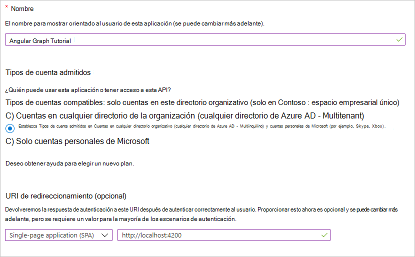

<!-- markdownlint-disable MD002 MD041 -->

En este ejercicio, creará un nuevo registro de aplicaciones Web de Azure AD con el centro de administración de Azure Active Directory.In this exercise, you will create a new Azure AD web application registration using the Azure Active Directory admin center.

1. Abra un explorador y vaya al [centro de administración de Azure Active Directory](https://aad.portal.azure.com).Open a browser and navigate to the [Azure Active Directory admin center](https://aad.portal.azure.com). Inicie sesión con una **cuenta personal** (también conocida como: cuenta Microsoft) o una **cuenta profesional o educativa**.Login using a **personal account** (aka: Microsoft Account) or **Work or School Account**.

1. Seleccione **Azure Active Directory** en el panel de navegación de la izquierda y, después, seleccione **registros de aplicaciones** en **administrar**.Select **Azure Active Directory** in the left-hand navigation, then select **App registrations** under **Manage**.

    

1. Seleccione **Nuevo registro**.Select **New registration**. En la página **Registrar una aplicación**, establezca los valores siguientes.On the **Register an application** page, set the values as follows.

    - Establezca **Nombre** como `Angular Graph Tutorial`.Set **Name** to `Angular Graph Tutorial`.
    - Establezca **Tipos de cuenta admitidos** en **Cuentas en cualquier directorio de organización y cuentas personales de Microsoft**.Set **Supported account types** to **Accounts in any organizational directory and personal Microsoft accounts**.
    - En **URI de redirección**, establezca la primera lista desplegable en `Web` y establezca el valor `http://localhost:4200`.Under **Redirect URI**, set the first drop-down to `Web` and set the value to `http://localhost:4200`.

    

1. Elija **Registrar**.Choose **Register**. En la página **tutorial de gráfico** de angular, copie el valor del identificador de la **aplicación (cliente)** y guárdelo, lo necesitará en el paso siguiente.On the **Angular Graph Tutorial** page, copy the value of the **Application (client) ID** and save it, you will need it in the next step.

    

1. Seleccione **Autenticación** en **Administrar**.Select **Authentication** under **Manage**. Busque la sección **concesión implícita** y habilite **tokens de acceso** y tokens de **identificador**.Locate the **Implicit grant** section and enable **Access tokens** and **ID tokens**. Elija **Guardar**.Choose **Save**.

    
